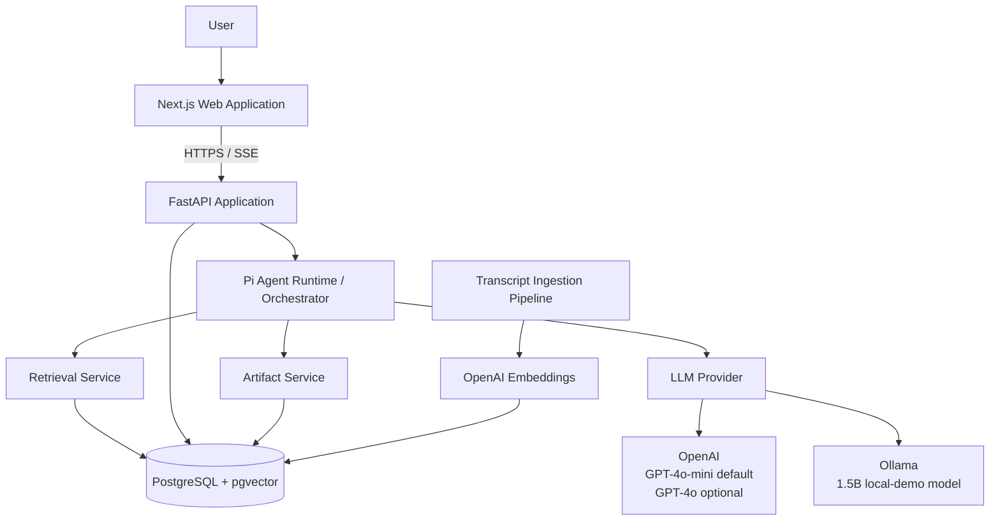
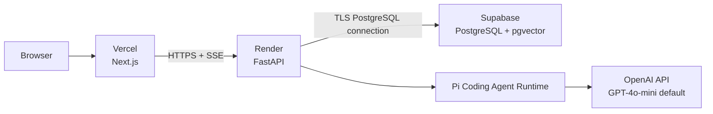
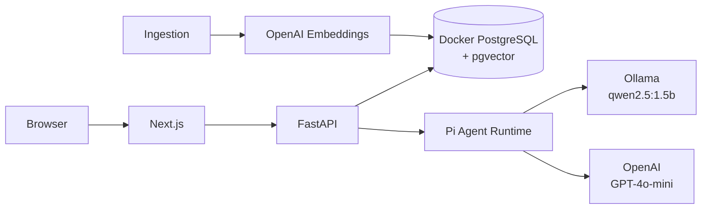
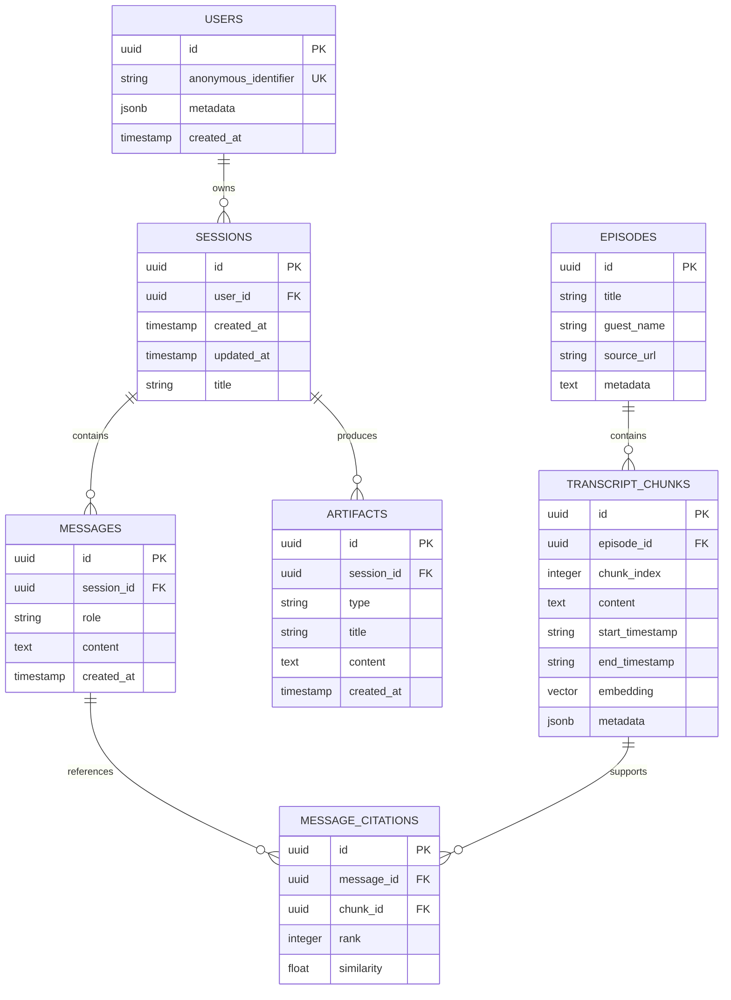
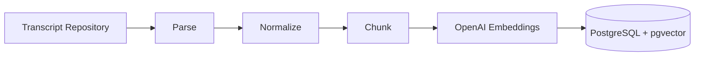
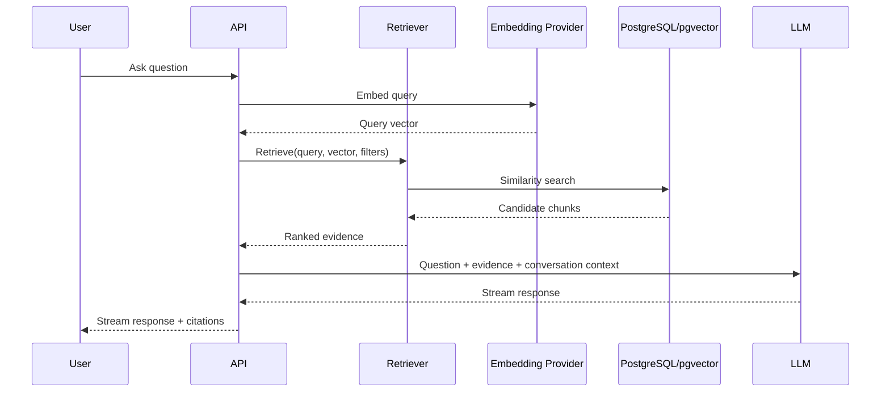
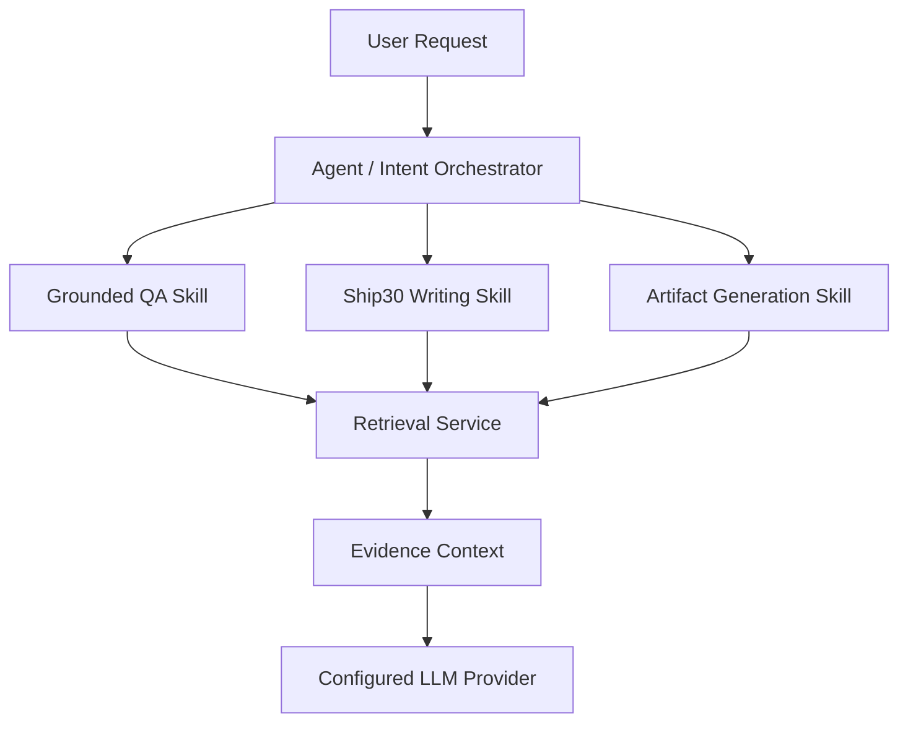
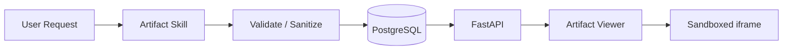
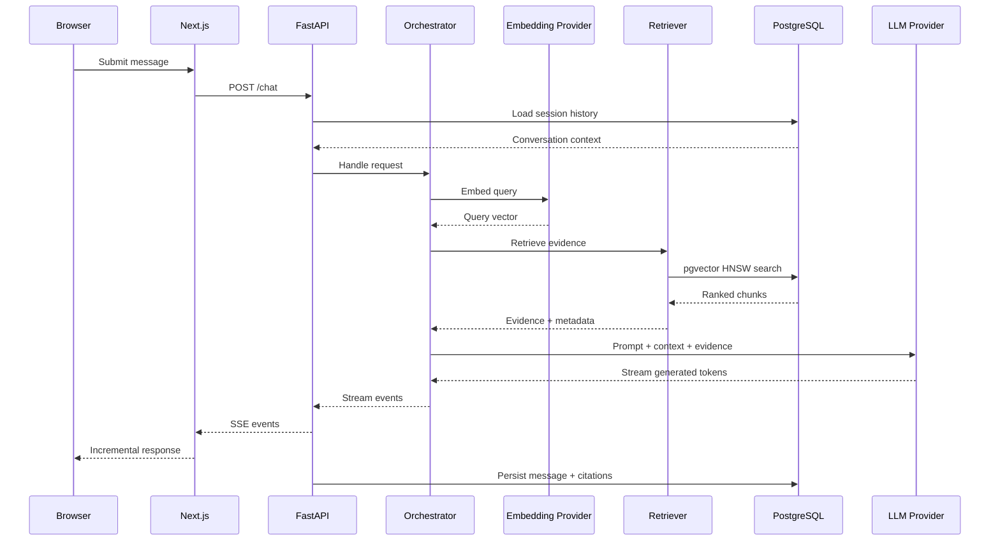

# Lenny Growth Assistant — System Architecture

**Status:** Draft / Implementation Baseline  
**Version:** 1.1  
**Last Updated:** 2026-09-04  
**Audience:** Evaluators, engineers, maintainers, and the implementation coding agent

---

## 1. Purpose

This document defines the technical architecture for the Lenny Growth Assistant take-home assignment.

It translates the approved product requirements into an implementable system design while preserving a deliberate separation between:

- **assignment-mandated requirements**
- **engineering decisions made for this implementation**
- **deployment-specific choices**
- **future alternatives that remain replaceable**

The architecture is intentionally production-minded without introducing infrastructure disproportionate to the expected workload of approximately 269 podcast transcripts.

---

## 2. Source of Truth and Architectural Principles

The Oogway assignment/reference documents are the primary source of truth for product and technical requirements. Where they prescribe or strongly recommend a technology or capability, this architecture follows that direction. Where they permit alternatives, the decision is made explicitly below.

### Core principles

1. **Grounding over model memory** — transcript evidence is the source of truth for corpus questions.
2. **Simple infrastructure** — use PostgreSQL + pgvector instead of introducing a dedicated vector database for a relatively small corpus.
3. **Provider independence** — LLM and embedding providers are configuration-driven and isolated behind interfaces.
4. **Local reproducibility** — the mandatory Ollama path must work locally despite constrained hardware.
5. **OpenAI-only cloud path** — OpenAI is the sole paid cloud provider because the developer has approximately US$4 in OpenAI credit and no Anthropic API credit. The default cloud model is selected for cost discipline.
6. **One application, multiple model configurations** — switching between Ollama and OpenAI must not require application redesign.
7. **Explicit boundaries** — retrieval, agent orchestration, persistence, API transport, and presentation remain separate concerns.
8. **Evidence is inspectable** — retrieval results and citations are first-class application data.
9. **Fail safely** — insufficient evidence must not silently become fabricated certainty.
10. **Optimize for the assignment's workload** — avoid premature distributed systems, dedicated vector infrastructure, or Kubernetes.

---

# 3. System Context



### Runtime environments

There are two supported environments.

**Local development/demo**

```text
Next.js
FastAPI
PostgreSQL + pgvector
Pi Coding Agent runtime
OpenAI GPT-4o-mini + text-embedding-3-small
Ollama qwen2.5:1.5b (mandatory local demo only)
```

**Hosted deployment**

```text
Vercel       → Next.js
Render       → FastAPI
Supabase     → PostgreSQL + pgvector
OpenAI       → GPT-4o-mini / text-embedding-3-small
```

The deployed environment does not depend on the developer's local Ollama instance. The Ollama path remains a reproducible local/demo configuration.

---

# 4. Deployment Topology



## Local topology



### Why local-first?

The assignment calls for reproducible setup and a local Ollama demonstration. Developing first against Dockerized PostgreSQL + pgvector provides:

- deterministic setup
- no dependency on hosted database availability
- faster schema iteration
- low-cost development
- clean migration to hosted Supabase

The application only depends on a PostgreSQL connection string, so local PostgreSQL and Supabase remain interchangeable deployment targets.

---

# 5. Component Architecture

## 5.1 Frontend

**Technology**

- Next.js
- TypeScript
- Tailwind CSS
- React
- Markdown rendering for assistant responses
- Sandboxed iframe for generated HTML artifacts

### Responsibilities

- Chat UI
- Session navigation
- Message rendering
- Citation display
- Streaming response handling
- Artifact preview/download
- Loading and error states

The frontend must **not**:

- call OpenAI directly
- call Ollama directly
- contain database credentials
- implement retrieval
- make agent-routing decisions

All privileged operations go through FastAPI.

---

## 5.2 FastAPI Application

The backend is the system's application boundary.

Suggested logical modules:

```text
backend/
├── api/
│   ├── chat.py
│   ├── sessions.py
│   └── artifacts.py
├── application/
│   ├── chat_service.py
│   ├── session_service.py
│   └── artifact_service.py
├── agent/
│   ├── orchestrator.py
│   ├── skills/
│   └── prompts/
├── retrieval/
│   ├── retriever.py
│   ├── chunking.py
│   └── embeddings.py
├── providers/
│   ├── llm.py
│   ├── openai.py
│   └── ollama.py
├── db/
│   ├── models.py
│   ├── repositories/
│   └── session.py
└── core/
    ├── config.py
    └── logging.py
```

The exact file structure may evolve during implementation, but these responsibilities should remain separated.

---

# 6. Data Architecture

## 6.1 PostgreSQL + pgvector

PostgreSQL is the single persistence system.

It stores both relational application data and vectorized transcript chunks.

This avoids:

```text
PostgreSQL + Qdrant
```

for a workload that does not justify a second datastore.

The Oogway reference specifically points toward PostgreSQL + pgvector and an HNSW index.

---

## 6.2 Logical Data Model



The exact SQL schema and migrations must be finalized in an implementation-contract appendix to this architecture before implementation. They do not belong in the UI/UX design specification.

`USERS` is intentionally an anonymous lightweight identity record, not an authentication system. It satisfies the assignment's user-metadata persistence requirement without expanding the first version into accounts, login, or multi-tenancy. `metadata` is limited to non-sensitive information needed for product operation and debugging.

---

# 7. Transcript Ingestion Pipeline

The transcript repository supplied by Oogway is treated as the authoritative corpus.



## Pipeline responsibilities

### Parse

Extract:

- episode identity
- title
- guest
- transcript text
- timestamps where available
- source URL/metadata where available

### Normalize

Normalize:

- whitespace
- transcript formatting
- speaker markers where useful
- timestamp representation

Do not destroy source information required for citations.

### Chunk

Chunk transcripts into semantically useful retrieval units.

The initial strategy should favor **moderate-sized, overlapping chunks**, with boundaries aligned to transcript structure where possible rather than blindly splitting every N characters.

Chunk size and overlap should be treated as tunable retrieval parameters and evaluated against actual questions.

### Embed

Generate embeddings using:

**OpenAI `text-embedding-3-small`**

This is a deliberate development decision:

- removes CPU/RAM pressure from the developer machine
- provides strong general-purpose semantic representations
- keeps ingestion simple
- can be replaced later through the embedding-provider abstraction

### Store

Each chunk stores:

- source episode
- transcript text
- timestamp information
- embedding
- metadata

Ingestion must be **idempotent**. Re-running ingestion should not create duplicate corpus records.

---

# 8. Retrieval Architecture

Retrieval is an independent service rather than an implicit capability hidden inside an LLM prompt.



## Initial retrieval strategy

1. Embed the user query.
2. Search transcript chunks using pgvector cosine similarity.
3. Use the HNSW index for approximate nearest-neighbor retrieval.
4. Apply metadata constraints when relevant.
5. Select a bounded set of high-quality candidates.
6. Pass evidence to the generation layer.
7. Persist citation relationships.

### Retrieval should not blindly return a fixed number forever

The initial implementation may use a configurable top-K, but retrieval should also consider:

- similarity threshold
- duplicate/near-duplicate chunks
- source diversity
- context-window limits

The final values should be chosen empirically.

### Conversational Memory & Query Rewriting (Turn 2+)

To ensure seamless conversational context without polluting vector search with conversational chit-chat, the retrieval service employs a `QueryRewriter` on multi-turn conversations:
1. When a user asks a follow-up (e.g. *"and how do i collect this customer data?"*), the system detects Turn 2+.
2. A fast LLM call (`gpt-4o-mini`) inspects the recent turns and rewrites the query into an explicit, standalone semantic search string incorporating the contextual subject.
3. This standalone query is passed to `pgvector`, ensuring high cosine recall while preserving full conversation history in the UI.

### Task Prefix Cleaning & Acronym Expansion

Before vector embedding, the query is passed through `strip_task_prefixes`:
- Strips UI meta-instructions (e.g. *"Write a Ship 30 for 30 essay on..."*, *"Create an interactive HTML card comparing..."*).
- Expands domain acronyms (e.g. `PLG vs SLG` $\rightarrow$ `Product-Led Growth (PLG) vs Sales-Led Growth (SLG)`).
- This prevents generative directives from degrading cosine similarity scores against transcript dialogue.

---

# 9. Grounding Contract

The generation layer receives structured evidence, not just raw search results.

Conceptually:

```text
Question
Conversation context
Retrieved evidence
Evidence metadata
Generation instructions
```

The model must be instructed to:

- answer using supplied evidence for corpus questions
- avoid inventing transcript claims
- preserve uncertainty
- cite supporting evidence
- state when evidence is insufficient

The application should not equate:

```text
LLM produced an answer
```

with:

```text
Answer is grounded.
```

Grounding is a property established by retrieval + evidence injection + citation tracking.

---

# 10. LLM Provider Architecture

The system supports two interchangeable LLM configurations and exactly one paid cloud provider:

```text
                 LLMProvider
                     │
             ┌───────┴────────┐
             │                │
          OpenAI             Ollama
     Cloud / default      Local / demo
```

## OpenAI

**Only cloud provider. Default generation model: `gpt-4o-mini`.**

The project has approximately US$4 in OpenAI credit and no Anthropic API credit. Therefore OpenAI is used for normal cloud inference, development, writing generation, artifact generation, retrieval evaluation, and the default embedding path. `gpt-4o` remains an optional configuration for a deliberately limited final quality comparison; it is not the normal model under this budget.

**Default embeddings: `text-embedding-3-small`.** Ingestion is idempotent and embeddings are reused, which avoids spending credits again for ordinary question answering.

Every OpenAI request must emit structured telemetry for selected model, input/output tokens where available, estimated cost, and request outcome. The demo must stop or clearly fail safely when its configured budget ceiling is reached; it must not unexpectedly keep spending.

## Ollama

Ollama is the required local-model path, but it is not the normal cloud-quality path.

The development machine has approximately 7.5 GiB RAM, CPU-only inference, 4 GiB swap, and no dedicated GPU. The initial mandatory demo configuration is therefore:

```text
OLLAMA_MODEL=qwen2.5:1.5b
```

The selected model must be benchmarked before the demo. If it cannot meet the responsiveness target, the result and limitation are disclosed rather than hidden.

The model is configuration, not architecture. A user with more capable hardware can set a 7B/8B Ollama model through the same provider interface, without application-code changes.

---

# 11. Provider Interface

Conceptually:

```python
class LLMProvider(Protocol):
    async def generate(...): ...
    async def stream(...): ...
```

and:

```python
class EmbeddingProvider(Protocol):
    async def embed_documents(...): ...
    async def embed_query(...): ...
```

The application layer depends on these interfaces rather than OpenAI/Ollama SDKs directly.

This allows:

```text
Normal cloud/default:
OpenAI GPT-4o-mini

Mandatory local demo:
Ollama / qwen2.5:1.5b

Higher-resource deployment:
Ollama / larger model

Future:
another compatible provider
```

without changing agent, retrieval, or API contracts.

---

# 12. Agent Architecture

The assistant should not be implemented as one giant prompt.

The logical flow is:



## Grounded QA Skill

Responsible for:

- understanding the user's question
- retrieving evidence
- answering from evidence
- producing citations
- handling insufficient evidence

## Ship30 Writing Skill

Responsible for:

- understanding the desired writing output
- using relevant conversation/evidence
- producing structured writing
- maintaining attribution/grounding when source-derived

## Artifact Generation Skill

Responsible for:

- producing the requested artifact
- validating the output format
- persisting the artifact
- making it available to the frontend

### Important boundary

Skills should **call application services** rather than directly manipulating the database.

```text
Skill
  ↓
RetrievalService
  ↓
Repository
  ↓
PostgreSQL
```

not:

```text
Skill
  ↓
raw SQL
```

---

# 13. Agent Framework Decision

**Decision: use the Pi Coding Agent SDK as the required agent layer.**

The primary Oogway assignment permits either the Anthropic Claude Agent SDK or Pi Coding Agent. Pi is the correct choice for this implementation because its runtime supports `OPENAI_API_KEY`, custom providers, skills, custom tools, and streamed agent sessions. It can therefore drive OpenAI and Ollama without Anthropic API usage. See the [Pi SDK documentation](https://pi.dev/docs/latest/sdk) and [custom-provider documentation](https://pi.dev/docs/latest/custom-provider).

The Claude Agent SDK is intentionally not selected: routing Claude Code through a gateway adds infrastructure, and Anthropic explicitly does not support routing Claude Code to non-Claude models through a gateway. The project must not represent a proxy workaround as a supported OpenAI-only Claude SDK setup.

### Integration boundary

FastAPI remains the public API, validation boundary, persistence authority, and SSE owner. A small internal Node-based Pi runtime is invoked only by FastAPI; it is not exposed directly to the browser or treated as an independently deployable product service.

```text
Browser → FastAPI → Pi Agent Runtime → selected LLM provider
                    │
                    ├── grounded_qa skill
                    ├── ship30_writer skill
                    └── artifact_generator skill
```

The Pi runtime receives the session context and evidence prepared by FastAPI, returns structured stream events, and has access only to explicitly registered application tools. It must not receive general filesystem, shell, or network-browsing tools.

The integration must not leak provider-specific assumptions into retrieval, persistence, skill interfaces, API contracts, or frontend behaviour. FastAPI-owned PostgreSQL state remains authoritative; Pi's own session persistence is not used as the application record.

---

# 14. Conversation State

The database is the durable source of conversation history.

```text
Session
  ├── Message
  ├── Message
  ├── Message
  └── Artifact
```

The application should load the relevant conversation context for each request.

Do not depend exclusively on an LLM provider's remote conversation state because:

- it reduces portability
- complicates local execution
- makes persistence provider-dependent
- makes session recovery harder

---

# 15. Streaming Architecture

Use **Server-Sent Events (SSE)** for assistant streaming.

```text
Browser
   │
   │ POST /chat
   ▼
FastAPI
   │
   ├── retrieve
   ├── generate
   │
   └── SSE stream
        ↓
     Browser
```

SSE is preferred over WebSockets because the primary requirement is server-to-client token/event streaming rather than bidirectional realtime communication.

Possible event types:

```text
message.start
retrieval.complete
message.delta
citation.add
artifact.ready
message.complete
error
```

The exact event contract must be finalized in the architecture implementation-contract appendix; `design.md` consumes its user-visible states rather than defining transport payloads.

---

# 16. Artifact Architecture

Generated HTML/CSS artifacts are treated as **untrusted generated content**.



## Security requirements

Generated artifacts must not execute with the privileges of the host application.

The preview should use a sandboxed iframe.

The application should avoid:

- injecting generated HTML directly into the main DOM
- allowing generated JavaScript unrestricted access to the parent page
- executing generated server-side code on the host

Downloadable artifact content should be treated as user-generated/untrusted output.

---

# 17. Security Architecture

## Secrets

Secrets exist only on the backend:

```text
OPENAI_API_KEY
DATABASE_URL
OLLAMA_BASE_URL
```

The frontend receives no provider credentials.

Use environment variables and provide:

```text
.env.example
```

with placeholder values only.

## Database

- Use parameterized queries/SQLAlchemy.
- Use least-privilege credentials where supported.
- Do not expose PostgreSQL directly to the browser.
- Use TLS for hosted database connections.

## Artifact rendering

Use iframe sandboxing and appropriate content-security controls.

## Input validation

Validate:

- API payloads
- session identifiers
- artifact identifiers
- message sizes
- other externally supplied values

---

# 18. Error Handling

Errors should be categorized by subsystem.

| Failure | Behaviour |
|---|---|
| Database unavailable | Return graceful service error; log root cause |
| Embedding failure | Abort retrieval request safely |
| Retrieval returns weak evidence | Explain insufficient evidence |
| LLM unavailable | Return generation failure without corrupting session |
| Ollama unavailable | Clearly report local-model dependency failure |
| Artifact generation failure | Preserve conversation; report artifact failure |
| Invalid request | HTTP 4xx with structured error |
| Unexpected exception | HTTP 5xx with safe user message + server logs |

A failed generation must not result in a partially persisted assistant message being presented as complete.

---

# 19. Observability

For the scope of this assignment, structured application logging is sufficient.

Log useful diagnostic metadata such as:

- request/session ID
- operation
- retrieval latency
- embedding latency
- LLM latency
- selected provider
- model name
- number of retrieved chunks
- retrieval threshold
- error category

Do **not** log:

- API keys
- credentials
- unnecessary sensitive user content

The objective is to make failures diagnosable without introducing a full enterprise observability platform.

---

# 20. Testing Strategy

Testing should be layered.

## Unit tests

Cover:

- chunking
- metadata parsing
- provider interfaces
- retrieval ranking logic
- citation construction
- request validation
- artifact validation

## Integration tests

Cover:

- FastAPI + PostgreSQL
- ingestion → database
- retrieval → pgvector
- session persistence
- artifact persistence

## Retrieval evaluation

Create a small representative evaluation set containing questions with known relevant transcript evidence.

Evaluate:

- whether the correct episode is retrieved
- whether the relevant chunk appears
- citation correctness
- insufficient-evidence behaviour

Retrieval quality should be measured independently from LLM fluency.

## End-to-end tests

At minimum:

```text
Question
 → retrieve
 → generate
 → cite
 → persist
 → reload session
```

and:

```text
Question
 → Ship30 skill
 → artifact generation
 → persist
 → preview/download
```

---

# 21. Configuration Strategy

Configuration controls provider selection and cost, never application structure.

```text
AGENT_RUNTIME=pi

LLM_PROVIDER=openai
OPENAI_MODEL=gpt-4o-mini
OPENAI_API_KEY=...
OPENAI_BUDGET_USD=4.00

EMBEDDING_PROVIDER=openai
OPENAI_EMBEDDING_MODEL=text-embedding-3-small

DATABASE_URL=...

OLLAMA_BASE_URL=http://localhost:11434
OLLAMA_MODEL=qwen2.5:1.5b
```

The mandatory local demo changes only:

```text
LLM_PROVIDER=ollama
OLLAMA_MODEL=qwen2.5:1.5b
```

An evaluator with stronger hardware can instead set, for example, `OLLAMA_MODEL=<7B-or-8B-model>`; no code change is required. A limited cloud quality check may set `OPENAI_MODEL=gpt-4o`, but the documented default remains `gpt-4o-mini`.

The user-selected provider is sent on each request, persisted with the resulting message, and displayed in the UI. Fallback is **manual and visible**: an unavailable provider or exhausted budget returns a structured error and preserves the current selection. The user may then select the other provider; FastAPI never silently changes it.

---

# 22. Local Resource Strategy

The development machine has:

- Intel Core i5-1235U
- 10 cores / 12 threads
- approximately 7.5 GiB RAM
- approximately 4 GiB swap
- CPU-only inference
- approximately 22 GiB free space at the start of architecture planning

Therefore:

### Do

- use Docker selectively
- use hosted OpenAI embeddings
- use lightweight Ollama inference
- keep the local database corpus bounded
- avoid unnecessary services

### Do not

- run a large local foundation model
- introduce Qdrant solely for this corpus
- run unnecessary observability infrastructure
- introduce Kubernetes
- duplicate large datasets across services

Hardware limitations influence the **deployment configuration**, not the application architecture.

---

# 23. Scalability and Trade-offs

The current architecture is intentionally optimized for the assignment workload.

### Current scale

Approximately 269 transcripts.

PostgreSQL + pgvector is appropriate because:

- corpus size is modest
- application data already belongs in PostgreSQL
- vector and relational metadata can be queried together
- HNSW provides efficient approximate nearest-neighbor search
- a second vector database would increase operational complexity

### Future scale

If the corpus grows substantially, potential evolution paths include:

1. stronger retrieval/reranking
2. partitioning/index optimization
3. dedicated vector infrastructure such as Qdrant
4. separate ingestion workers
5. caching
6. asynchronous job processing

These are intentionally deferred until workload evidence justifies them.

---

# 24. Architecture Decision Records

## ADR-001 — PostgreSQL + pgvector instead of Qdrant

**Decision:** PostgreSQL + pgvector.

**Alternatives considered:**

- PostgreSQL + pgvector
- Qdrant Cloud
- another dedicated vector database

**Why:**

- PostgreSQL is already required.
- Sessions, messages, artifacts, transcript metadata, and vectors can coexist.
- The corpus is relatively small.
- pgvector/HNSW satisfies the retrieval requirement.
- One datastore is easier to operate and reproduce.

**Trade-off:**

A dedicated vector database may become preferable at substantially larger scale or with more specialized vector-search requirements.

---

## ADR-002 — Supabase for hosted PostgreSQL

**Decision:** Use Supabase as the hosted PostgreSQL provider.

**Important distinction:**

Supabase is the **hosting/deployment implementation**, not the database abstraction.

The application targets PostgreSQL.

**Local:**

```text
Docker PostgreSQL + pgvector
```

**Hosted:**

```text
Supabase PostgreSQL + pgvector
```

This keeps the application portable.

---

## ADR-003 — Local-first development

**Decision:** Develop locally against Dockerized PostgreSQL + pgvector before deploying to Supabase.

**Why:**

- reproducibility
- faster iteration
- no hosted dependency during development
- easy database reset
- simpler debugging

Hosted deployment is added after the core vertical slice is stable.

---

## ADR-004 — OpenAI embeddings

**Decision:** OpenAI `text-embedding-3-small`.

**Why:**

- avoids local CPU/RAM pressure
- simple API integration
- appropriate for the corpus
- embedding generation is primarily an ingestion concern
- provider abstraction keeps it replaceable

**Alternative:** local Ollama embeddings.

**Trade-off:** cloud API dependency and cost, balanced against substantially lighter local resource usage.

---

## ADR-005 — Cost-disciplined OpenAI cloud inference

**Decision:** Use OpenAI as the only cloud provider, with `gpt-4o-mini` as the default generation model and `gpt-4o` as a configuration-only, limited final-quality option.

**Why:**

- the developer has approximately US$4 in OpenAI credit and no Anthropic API credit
- a smaller default protects the budget during development, retrieval evaluation, and demo preparation
- OpenAI supports the required cloud configuration and `text-embedding-3-small` provides the embedding path
- provider abstraction keeps the model swappable

**Alternative:** Anthropic models or a Claude SDK gateway route.

**Decision:** Not used. The project does not have Anthropic credits, and a gateway would add unsupported/avoidable infrastructure for this assignment.

---

## ADR-006 — 1.5B Ollama model for local demo

**Decision:** Start with `qwen2.5:1.5b` and benchmark it on the actual development machine; do not select a model larger than 2B parameters for the submitted local demo.

**Why:**

The mandatory local Ollama requirement must coexist with approximately 7.5 GiB RAM and CPU-only inference.

A larger model is not justified if it causes unacceptable latency or memory pressure. A 7B/8B model remains a documented configuration option for evaluators with sufficient hardware.

**Important:** Model size is a deployment configuration, not a core architectural decision.

---

## ADR-007 — Next.js instead of React/Vite

**Decision:** Next.js + TypeScript.

**Alternatives:**

- React + Vite
- Next.js

**Why:**

- compatible with the assignment
- mature application structure
- strong routing/layout model
- natural Vercel deployment
- suitable for the required multi-view experience

**Trade-off:** More framework complexity than a minimal SPA requires.

---

## ADR-008 — SSE instead of WebSockets

**Decision:** Server-Sent Events.

**Why:**

The primary realtime requirement is server-to-client generation streaming.

SSE is simpler and sufficient.

**WebSockets would be justified if:** the application required substantial bidirectional realtime interaction.

---

## ADR-009 — No reranker initially

**Decision:** Start with pgvector semantic retrieval + thresholding/metadata filtering.

**Why:**

- keeps the system simple
- makes retrieval behaviour explainable
- avoids adding another inference dependency
- corpus is modest

Add a reranker only if evaluation demonstrates a meaningful retrieval-quality problem.

---

## ADR-010 — Provider abstraction

**Decision:** Isolate LLM and embedding providers behind interfaces.

**Why:**

The mandatory local Ollama path and cloud OpenAI path have different resource/quality characteristics.

The application should not need architectural changes to switch between them.

---

## ADR-011 — Pi Coding Agent SDK with OpenAI-only cloud usage

**Decision:** Use Pi Coding Agent SDK as the agent runtime, configured with OpenAI for the cloud path and Ollama for the local path.

**Why:**

- it satisfies the primary assignment's permitted agent-SDK requirement
- Pi supports `OPENAI_API_KEY`, skills, custom tools, streaming, and provider configuration
- it avoids Anthropic API credits and avoids an extra gateway solely to make Claude tooling reach an OpenAI model
- FastAPI can retain API validation, persistence, and public SSE control

**Trade-off:** a small Node-based runtime is needed alongside the Python FastAPI application. It is an internal adapter, not a separately exposed service.

---

# 25. End-to-End Request Flow



---

# 26. Deployment Sequence

Deployment should proceed in this order:

```text
1. Local database
       ↓
2. Transcript ingestion
       ↓
3. Retrieval validation
       ↓
4. FastAPI vertical slice
       ↓
5. Ollama local demo
       ↓
6. Next.js application
       ↓
7. Integration tests
       ↓
8. Supabase database
       ↓
9. Render backend
       ↓
10. Vercel frontend
       ↓
11. Production smoke test
```

The deployed system must not be considered complete until the full path is tested end-to-end.

---

# 27. Repository-Level Architecture

Suggested repository layout:

```text
lenny-growth-assistant/
│
├── frontend/
├── backend/
├── agent-runtime/             # Internal Node/Pi adapter; not browser-facing
├── ingestion/
├── tests/
│   ├── unit/
│   ├── integration/
│   └── evaluation/
│
├── docs/
│   ├── architecture.md
│   ├── design.md
│   └── evaluation.md
│
├── docker-compose.yml
├── .env.example
├── README.md
└── Makefile / task runner configuration
```

The exact build tooling can be finalized during implementation, but documentation, application, ingestion, and tests should remain clearly separated.

---

# 28. Definition of Architectural Success

The architecture is successful if:

- the application can run locally with one reproducible setup path
- PostgreSQL + pgvector stores both application data and embeddings
- the transcript corpus can be ingested idempotently
- retrieval can be tested independently
- answers are grounded and cited
- sessions survive application restarts
- Ollama can provide the mandatory local-model path
- OpenAI GPT-4o-mini provides the cost-disciplined cloud default; GPT-4o remains an optional limited quality check
- switching LLM providers does not require rewriting application logic
- artifacts are generated and safely rendered
- the application can be deployed to Vercel + Render + Supabase
- a reviewer can understand the major architectural decisions and their trade-offs

---

# 29. What This Architecture Deliberately Does Not Do

This system does **not** attempt to demonstrate architectural sophistication by adding infrastructure unnecessarily.

It deliberately avoids:

- Qdrant for the current corpus
- Kubernetes
- microservices
- distributed task queues
- custom model hosting
- model fine-tuning
- separate object storage unless later justified
- complex event-driven infrastructure
- enterprise-scale observability

The goal is a **well-engineered vertical product**, not an over-engineered platform.

The strongest architectural property is therefore not the number of technologies used; it is the clarity of the boundaries and the ability to change deployment/model choices without rewriting the product.

---

# 30. Implementation Gate

Before code generation begins, the following should be specified in an **implementation-contract appendix to this architecture** (or an explicitly linked `implementation-contract.md`):

1. Exact PostgreSQL schema and migrations.
2. Transcript parsing and chunking algorithm.
3. Embedding dimensions and pgvector column configuration.
4. HNSW index parameters.
5. Retrieval query and similarity threshold.
6. Metadata filtering strategy.
7. Citation data contract.
8. Agent/skill routing contract.
9. OpenAI/Ollama provider interfaces.
10. SSE event schema.
11. API endpoint contracts.
12. Artifact validation/sandbox policy.
13. Error taxonomy.
14. Test/evaluation dataset and retrieval metrics.
15. Local Docker Compose configuration.
16. Render/Vercel/Supabase deployment configuration.

**No coding agent should make these decisions implicitly during implementation.**

The purpose of the implementation contract is to turn these architectural boundaries into precise build instructions without overloading `design.md`, whose job is to specify the user experience.
